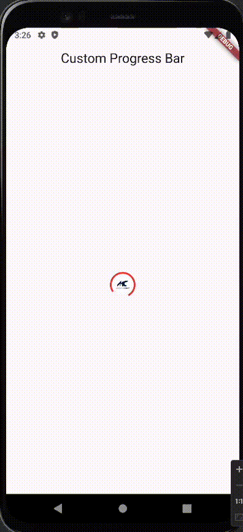

This is a package for custom progress where we have icon in the middle and progressbar around it
we can use it when we want with different icons . progress

## Getting started
This is a package for custom progress where we have icon in the middle and progressbar around it




## Usage 

We can use ``ProgressBar`` as Widget for Custom progress.Here is some parameters of
custom Progressbar. 
`containerHeight` is height of container.

`containerWidth` is width of container.

`progressColor` is color of ProgressBar.

`boxFit` is boxfit of container.

`iconHeight` is height of icon.

`iconWidth` is width of icon.

`imageFile` is asset file  of icon as String.

`progressStrokeWidth` is width of progressStroke.

`progressHeight` is height of Progressbar.

`progressWidth` is width of Progressbar.

      
```
ProgressBar(
containerHeight: 40,
containerWidth: 40,
progressColor: Colors.red,
boxFit: BoxFit.contain,
iconHeight: 30,
iconWidth: 30,
imageFile: 'assets/icon.png',
progressStrokeWidth: 3.0,
progressHeight: 50,
progressWidth: 50,
),
```
